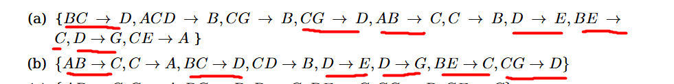
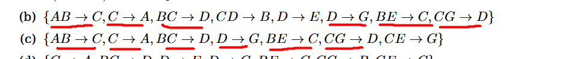
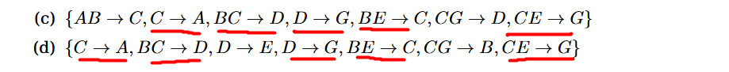
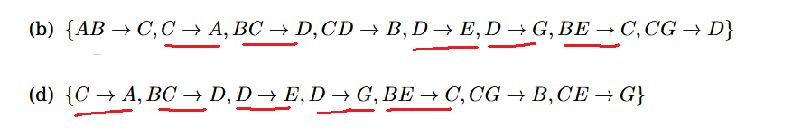

# 1.1

## a

Valida 

$W → Y, X → Z$

Aumento

$WX → YX$

Descomposición

$WX → Y, WX → X$

Por lo tanto $W → Y, X → Z \vdash WX → Y$

## b

Valida

$X → Y y Z ⊆ Y ⊢ X → Z$

Reflexividad

$Y → Z$

Transitividad

$X → Y, Y → Z ⊢ X → Z$

## c

Valida

$X → Y, X → W, W Y → Z ⊢ X → Z$

Union

$X → Y, X → W  ⊢ X → WY$

Transitividad

$ X → WY, W Y → Z ⊢ X → Z$

## d

No valido

| X | Y | Z |
| - | - | - |
| 1 | a | 5 |
| 2 | b | 5 |

## e

No valido

## f

Valido 

$X → Y, XY → Z ⊢ X → Z$

Reflexiva y aumento

$X → XY$

Transitivas

$X → XY, XY → Z ⊢ X → Z$

# 1.2

Para saber que conjunto de dependencias funcionales son equivalentes usamos la siguiente propiedad: $F \equiv G \iff  F^+ \equiv G^+$

Para los conjuntos a y b, las DF subrayadas estan en ambos. Faltan ver si los que no estan subrayadas se pueden derivar en el otro conjunto.

Para demostrar que 2 conjuntos no son equivalentes basta con dar una dependencia funcional que está en uno de los conjuntos y no el otro. (Una de las incluciones no se cumple).

Notar que en el conjunto a, la clausura positiva del atributo c es: 

$C^+ = \{A, B, C, D, E, G\}$

Y en b

$C^+ = \{ A, C \}$

Por lo que en b no tendremos varias de las dependencias funcionales correspondientes a C del lado izquierdo, por ejemplo $C → B$

En el conjunto c $C^+ = \{ A, C \}$. Con lo cual alcanza para afirmar que c $\not\equiv$ a, pero no a b.

en el conjunto c la clausula de D es: $D^+ = \{ D, G \}$. Como $D → E$ en b, entonces encontramos una DF que no está en c. No son equivalentes b y c.

Analicemos ahora el conjunto d.

Nuevamente podemos usar el argumento de la DF $D → E$ que está en d pero no en c para afirmar que no son equivalentes.

La clausula C de d es $C^+ = \{ A, C \}$. Nos sirve para afirmar que no es equivalente al conjunto a.

Falta ver si el conjunto b es equivalente al d.

Veamos la clausura positiva de AB en b: $(AB)^+= {A, B, C, D, E, G}$.

La misma clausuara en d: $(AB)^+ = {A, B}$

Luego d no tiene, por ejemplo, la DF $AB → E$

Concluimos que ningun conjunto es equivalente.

# 1.3

Para la descomposición binaria tenemos el siguiente critero para verificar SPI:

$ρ = (R1, R2)$ es lossless join respecto de $F \iff(R1 ∩ R2) → (R1 − R2) ∈ F^+$ o $(R1 ∩ R2) → (R2 − R1) ∈ F^+$.

Y para verificar preservación de DF:

Dados $R, ρ = (R_1, . . . , R_k)$ y $F$, $ρ$ preserva $F$ si la unión de las $DF$ en $π_{Ri} (F)$ implica lógicamente a F: $$F^+ = (\cup_{i_1}^k \pi_{R_i}(F))^+$$
Es decir, uno las dependencias funcionales proyectadas y la clausura de DF de la unión debe ser igual a la clausura original F.

## a

$(A, D) ∩ (B, C) = \emptyset$ y no vale $\emptyset → AD$ ni $\emptyset → BC$. Por lo tanto no es losless.

Para ver si preservan dependencias funcionales vemos las DF proyectadas de cada descomposición:

Para $R1 = (A,D)$ tenemos $F1 = \{D → A\}$, y para $R2 = (B,C)$ tenemos $F2 = \{B → C\}$. Si hacemos la unión de $F1$ y $F2$ obtenemos $FD_1$. Por lo tnato se preservan las DF.

## b

$(R1 ∩ R2) = (A, B)$. 

Para que sea SPI necesitamos entonces que en $FD_2^+$ este la DF $(A, B) → C$ o $(A, B) → D$. Como ambas están, entonces la descomposición es SPI.

$π_{R1} (FD_2) = \{ AB → D\}$

$π_{R2} (FD_2) = \{ AB → C, C → A\}$

Al hacer la unión de ambas proyecciónes vemos que perdimos $C→D$. No se preserva las DF.

## c

$(R1 ∩ R2) = C$.

Como $(R1 ∩ R2) → (R2 - R1): C → A$ se encuentra entre las DF, entonces es SPI.

$π_{R1} (FD_2) = \{C → D \}$

$π_{R2} (FD_2) = \{C → A\}$

La unión no es igual a $FD_2$ por lo tanto se pierden DF.

# 1.4

## a

|           | A   | B   | C   | D   | E   | F   | G   | H   | I   |
|-----------|-----|-----|-----|-----|-----|-----|-----|-----|-----|
| R1(A,B,D) | a1  | a2  | b13 | a4  | b15 | b16 | b17 | b18 | b19 |
| R2(D,E,F) | b21 | b22 | b23 | a4  | a5  | a6  | b27 | b28 | b29 |
| R3(F,G,C) | b31 | b32 | a3  | b34 | a5  | a6  | b37 | b38 | b39 |
| R4(C,H,I) | b41 | b42 | a3  | b46 | b47 | b48 | a7  | a8  | b49 |

$D → H$ F1 y F2

|           | A   | B   | C   | D   | E   | F   | G   | H   | I   |
|-----------|-----|-----|-----|-----|-----|-----|-----|-----|-----|
| R1(A,B,D) | a1  | a2  | b13 | a4  | b15 | b16 | b17 | b18 | b19 |
| R2(D,E,F) | b21 | b22 | b23 | a4  | a5  | a6  | b27 | b18 | b29 |
| R3(F,G,C) | b31 | b32 | a3  | b34 | a5  | a6  | b37 | b38 | b39 |
| R4(C,H,I) | b41 | b42 | a3  | b46 | b47 | b48 | a7  | a8  | b49 |

$H → AD$ F1 y F2

|           | A   | B   | C   | D   | E   | F   | G   | H   | I   |
|-----------|-----|-----|-----|-----|-----|-----|-----|-----|-----|
| R1(A,B,D) | a1  | a2  | b13 | a4  | b15 | b16 | b17 | b18 | b19 |
| R2(D,E,F) | a1  | b22 | b23 | a4  | a5  | a6  | b27 | b18 | b29 |
| R3(F,G,C) | b31 | b32 | a3  | b34 | a5  | a6  | b37 | b38 | b39 |
| R4(C,H,I) | b41 | b42 | a3  | b46 | b47 | b48 | a7  | a8  | b49 |

$A → B$ F1 y F2

|           | A   | B   | C   | D   | E   | F   | G   | H   | I   |
|-----------|-----|-----|-----|-----|-----|-----|-----|-----|-----|
| R1(A,B,D) | a1  | a2  | b13 | a4  | b15 | b16 | b17 | b18 | b19 |
| R2(D,E,F) | a1  | a2  | b23 | a4  | a5  | a6  | b27 | b18 | b29 |
| R3(F,G,C) | b31 | b32 | a3  | b34 | a5  | a6  | b37 | b38 | b39 |
| R4(C,H,I) | b41 | b42 | a3  | b46 | b47 | b48 | a7  | a8  | b49 |

No hay mas dependencias funcionales que chequear que cumplan: $X → Y$, $f_k$ , $f_r$ con $r > k$ tales que $f_k [X] = f_r[X] y f_k[Y] \neq f_r[Y]$. Y no hay fila de simbolo distinguido "a". Por lo que la descomposición no es SPI.

## b

|             | A   | B   | C   | D   | E   | F   | G   | H   | I   |
|-------------|-----|-----|-----|-----|-----|-----|-----|-----|-----|
| R1(A,B,C,D) | a1  | a2  | a3  | a4  | b15 | b16 | b17 | b18 | b19 |
| R2(E,F,G)   | b21 | v22 | b23 | b24 | a5  | a6  | a7  | b28 | b29 |
| R3(H,I)     | b31 | b32 | b33 | b34 | b35 | b36 | b37 | a8  | a9  |

No hay mas dependencias funcionales que chequear que cumplan: $X → Y$, $f_k$ , $f_r$ con $r > k$ tales que $f_k [X] = f_r[X] y f_k[Y] \neq f_r[Y]$. Y no hay fila de simbolo distinguido "a". Por lo que la descomposición no es SPI.

# 2.1

## a

Suponiendo que son atributos no multivaluados, entonces cumple 1FN.

Para el resto de formas normales debemos calcular las superclaves y claves:

Los atributos que no aparecen a la derecha de ninguna DF: E, G, I. Por lo tanto estas deben pertenecer a cualquier superclave.

Ahora busquemos los atributos para formar una superclave.

{EGIA}$^+$ = {E, G, I, A, B, C}
{EGIAD}$^+$ = {E, G, I, A, B, C, D, F, H}

Tenemos una superclave. Notar que no es minimal:

{EGID}$^+$ = {E, G, I, A, B, C, D, F, H}

Probamos agregar a {EGI} los demás atributos y vemos que solo con el H obtenemos otra superclave (y además minimal: clave).

{EGIH}$^+$ = {E, G, I, H, C, A, D, B, F}

Luego la superclave es {EGIAD} y las minimales son {EGID} y {EGIH}.

Ahora corroboremos 2FN: todos los atributos no primos (que no pertenecen a alguna clave) deben depender de todos los atributos de alguna clave. 
Los atributos no primos son: A, B, C, F, y los no primos: D, E, G, H, I

Y para, por ejemplo A, tenemos la DF $H → A$ (que sale de la descompocisión $H → AD$). Por lo que $A$ depende parcialmente de una clave (EGIH), entonces no se está en la 2FN. (Se debería tener al menos la DF $EGIH → A$).

Al no estar en 2FN, no está tampoco en 3FN ni FNBC.

## b

> Calculamos primero un cubrimiento minimal de F = $\{A → B, CD → F, H → AD, I → C, D → H\}$

- Todo lado derecho es un atributo único (descomposición)

FM = $\{A → B, CD → F, H → D, H → A, I → C, D → H\}$

- Todo lado izquierdo es reducido.

Son todos reducidos.

- No hay DF redundantes (que salen de transitividad)

No las hay.

> Aplicamos el algoritmo:

1. Crear un subesquema $(X , A)$ para cada dependencia $X → A$ en $FM$

R1 = (A,B), R2 = (C,D,F), R3 = (H, D), R4 = (H, A), R5 = (I, C), R6 = (D, H)

2. Unificar los que provienen de $DF$ con igual lado izquierdo: $(X , A_1, . . . , A_n)$

Unificamos R3 y R4, y renombramos

R1 = (A,B), R2 = (C,D,F), R3 = (H, D, A), R4 = (I, C), R5 = (D, H)

3. Si ningún esquema contiene una clave, agregar uno con los atributos de alguna clave

Ningun esquema continue alguna de las claves: {EGID} y {EGIH}.

R1 = (A,B), R2 = (C,D,F), R3 = (H, D, A), R4 = (I, C), R5 = (D, H), R6 = (D, E, G, I)

4. Eliminar esquemas redundantes (contenidos en otro)

R5 esta contenido en R3. Eliminamos y renombramos

R1 = (A,B), R2 = (C,D,F), R3 = (H, D, A), R4 = (I, C), R5 = (D, E, G, I)

## c

$R$ está en FNBC si para toda $DF$ no trivial $X → A$ sobre $R$, $X$ es superclave de $R$

Recordar que las superclaves eran: EGID, EGIAD, EGIH

Veamos cada dependencia funcional:

$R(A,B,C,D,E,F,G,H,I) y DF: \{A → B, CD → F, H → AD, I → C, D → H\}$

$A → B$ No cumple con FNBC

$$
R(A,C,D,E,F,G,H,I) DF: \{CD → F, H → AD, I → C, D → H \}\\

R1(A,B) DF_1=\{ A → B \}
$$

$CD → F$ No cumple

$$
R(A,C,D,E,G,H,I) DF: \{H → AD, I → C, D → H \}\\

R1(A,B) DF_1=\{ A → B \}

R2(C,D,F) DF_2=\{ CD → F \}
$$

$H → AD$ no cumple

$$
R(C,E,G,H,I) DF: \{ I → C \}\\

R1(A,B) DF_1=\{ A → B \}

R2(C,D,F) DF_2=\{ CD → F \}

R2(H,A,D) DF_2=\{ H → AD, D → H \}
$$

$I → C$ No cumple

$$
R(E,G,H,I) DF: \{\}\\

R1(A,B) DF_1=\{ A → B \}

R2(C,D,F) DF_2=\{ CD → F \}

R2(H,A,D) DF_2=\{ H → AD, D → H \}

R3(I,C) DF_3=\{ I → C \}
$$

# 2.2

$R=(U, A, T, K) DF= \{U → TA\}$

Como U no es superclave de R entonces R no está en FNBC. En particular, $U → TA$ es una dependencia no trivial y $U$ no es superclave. Que es la condición necesaria para que R esté en FNBC.

# 2.3

Los atributos son: $B, I, E, A, D, C$ y las DF $F \{A → D, I → B, IA → C, B → E \}$

## a

$\{IA\}^+ = A, I, C, B, E, D$

IA es una superclave al determinar funcionalmente a todos los atributos. Más aún es una clave al ser minimal. (Si saco I pierdo la determinación de I, B, E. Si saco A pierdo la de A, D)

## b

No es SPDF. Al hacer las proyecciones de las DF queda:

$$
(I, B): I → B \\
(I, A, C): IA → C \\
(A, D): A → D \\
(I, A, E): I → E
$$

Al hacer la union de todas las DF proyectadas perdimos $B → E$

Ahora para verificar si la descomposición es SPI usamos el algoritmo de tableau:

$\{A → D, I → B, IA → C, B → E \}$

|       | B   | I   | E   | A   | D   | C   |
|-------|-----|-----|-----|-----|-----|-----|
| I,B   | a1  | a2  | b13 | b14 | b15 | b16 |
| I,A,C | b21 | a2  | b23 | a4  | b25 | a6  |
| A,D   | b31 | b32 | b33 | a4  | a5  | b36 |
| I,A,E | b41 | a2  | a3  | a4  | b45 | b46 |

$A → D$

|       | B   | I   | E   | A   | D   | C   |
|-------|-----|-----|-----|-----|-----|-----|
| I,B   | a1  | a2  | b13 | b14 | b15 | b16 |
| I,A,C | b21 | a2  | b23 | a4  | a5  | a6  |
| A,D   | b31 | b32 | b33 | a4  | a5  | b36 |
| I,A,E | b41 | a2  | a3  | a4  | a5  | b46 |

$I → B$

|       | B   | I   | E   | A   | D   | C   |
|-------|-----|-----|-----|-----|-----|-----|
| I,B   | a1  | a2  | b13 | b14 | b15 | b16 |
| I,A,C | a1  | a2  | b23 | a4  | a5  | a6  |
| A,D   | b31 | b32 | b33 | a4  | a5  | b36 |
| I,A,E | a1  | a2  | a3  | a4  | a5  | b46 |

$IA → C$

|       | B   | I   | E   | A   | D   | C   |
|-------|-----|-----|-----|-----|-----|-----|
| I,B   | a1  | a2  | b13 | b14 | b15 | b16 |
| I,A,C | a1  | a2  | b23 | a4  | a5  | a6  |
| A,D   | b31 | b32 | b33 | a4  | a5  | b36 |
| I,A,E | a1  | a2  | a3  | a4  | a5  | a6  |

$B → E$

|       | B   | I   | E   | A   | D   | C   |
|-------|-----|-----|-----|-----|-----|-----|
| I,B   | a1  | a2  | a3  | b14 | b15 | b16 |
| I,A,C | a1  | a2  | a3  | a4  | a5  | a6  |
| A,D   | b31 | b32 | b33 | a4  | a5  | b36 |
| I,A,E | a1  | a2  | a3  | a4  | a5  | a6  |

La segunda fila son todos simbolos distinguidos $a_i$ por lo que concluimos que la descomposición es SPI.

## c

La condición de 3FN es que para toda DF $X → Y$, o $X$ es superclave o $Y$ forma parte de alguna clave.

Mirando las proyecciones de las DF, 

$$
(I, B): I → B  \text{, se encuentra en 3FN}\\
(I, A, C): IA → C \text{, se encuentra en 3FN}\\
(A, D): A → D \text{, se encuentra en 3FN}\\
(I, A, E): I → E \text{, No se encuentra en 3FN}
$$

Basta con descomponer $(I, A, E)$ en $(I, E)$ y $(I, A)$. Notar que $(I, A)$ está contenido en $(I, A, C)$, por lo que podemos omitirlo. Queda:

$$
(I, B): I → B  \text{, se encuentra en 3FN}\\
(I, A, C): IA → C \text{, se encuentra en 3FN}\\
(A, D): A → D \text{, se encuentra en 3FN}\\
(I, E): I → E \text{, se encuentra en 3FN}
$$

Otra opción es tomar una relación con todos los atributos y las dependencias funcionales, y ejecutar el algoritmo que genera una descomposición SPI y SPDF y que mantiene 3FN.

Notar que la solución dada está en 3FN pero no es SPDF (se perdió B → E).

# 2.5

## a

La unica clave es AGCE. Ninguna de las 3 DF cumple la condición necesaria para 3FN: $X → A$ sobre $R$, $X$ es superclave de $R$ o $A$ es primo (depende totalmente de alguna clave). 

Anomalia de actualización e inserción

| A  | B  | C  | D  | E  | G  |
|----|----|----|----|----|----|
| a1 | b1 | c1 | d1 | e1 | g1 |
| a2 | b1 | c2 | d1 | e2 | g2 |

Para actualizar un valor correspondiente a instancias B=b1, debemos actualizar 2 instancias de la relación.

Y no podemos insertar un nuevo valor (b2, d2) sin definir antes el valor para el resto de atributos. 

Al B no ser superclave (o D no ser primo) en la DF B → D, entonces permitimos que los demás atributos tomen otros valores para un mismo valor de (B, D).

## b

Resultado del algoritmo de descomposicion en 3FN SPI y SPDF: R1(AGCE), R2(A, B), R3(B, D)

## c

Si está en FNBC.

# 2.7

# 2.9

# 2.11

# 2.12

# 2.13

## a

Al menos se encuentra en 1FN.

La clave es {idProducto, idVendedor}. Por la DF $Vendedor → Comision$, Comisión, un atributo no primo, depende parcialmente de la clave. Concluimos que no se encuentra en 2FN. Y por lo tanto tampoco en 3FN ni FNBC.

## b

Aplicamos el algoritmo de normalización SPI y SPDF (no lo piden, se podría dar cualquiera)

Parte de una cobertura minimal de las DF: los lados derechos son atributos únicos, todo lado izquierdo es reducido y no hay DF redundantes.

El conjunto de DF ya se encuentra reducido.

1. Crear subesquemas (X, A) por cada DF X → A

R1(Fecha, Descuento), R2(idVendedor, Comisión)

1. Unificar aquellas que tengan mismo lado izquierdo. Ninguna
2. Si no hay un esquema con alguna clave (En este caso asumo que la clave es la PK dada. Si analizamos las DF la clave deberia ser (idProducto, idVendedor, fecha)), agregarla:

R3(idProducto, idVendedor)

1. Eliminar relaciones redundantes. No hay

# 2.14

## a

Falso

## b

Verdadero

## c

Falso

## d

Verdadero

## e

Falso

# 2.15

## a

Falso

## b

Verdadero

## c

Falso

## d

Falso

# 2.16

## a

Falso, la condición de FNBC es que la izquierda de la DF sea superclave

## b

Falso. La condición de 2FN es que todo atributo que no forma una clave (atributo no primo) debe depender totalmente de una clave. B solo depende de A y no de C ni E.
Al no estar en 2FN, tampoco está en 3FN. 

## c

Falso. 

## d

Verdadero.