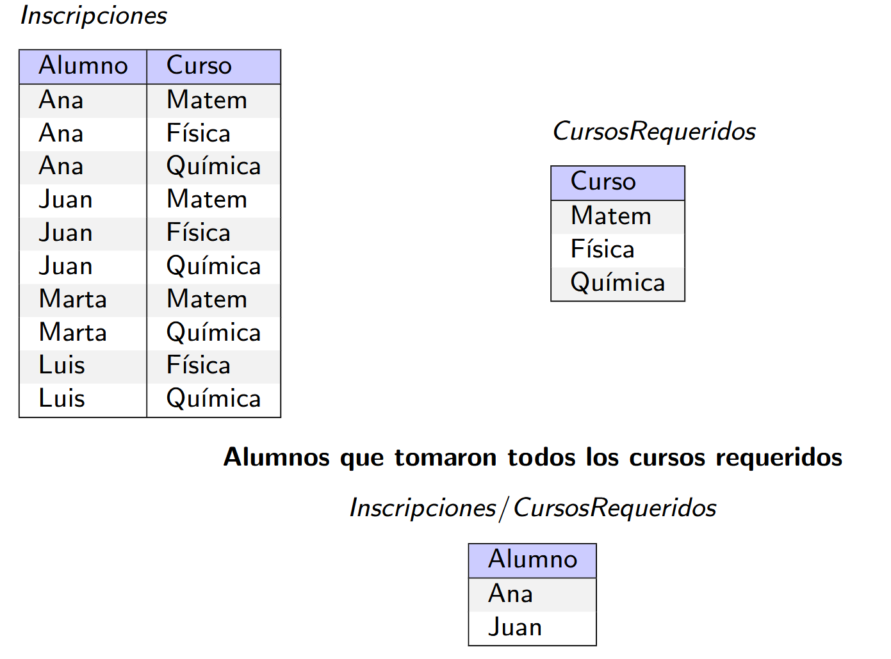

# Algebra relacional (AR)

Es un lenguaje formal y procedural de consultas para recuperar datos almacenados en un modelo relacional. Se detallan las operaciones a ejecutarse para producir el resultado.

Una consulta recibe de entrada 1 o 2 instancias de relación y devuelve una instancia de relación (las operaciones son cerradas y pueden componerse).

## Operaciones unarias

- Proyección: subconjunto de atributos (columnas) de una relación $π_{\text{<lista de atributos>}}(R)$
- Selección: subconjunto de instancias de una relación (filas) $σ_{<predicado>}(R)$
  - El predicado puede comparar atributos con atributos, con constantes y usando operaciones <, >, =,$\neq$, $\wedge$, $\vee$, $\neg$
- Renombre
  - Renombra atributos: $ρ (a1 → a2, b1 → b2, R)$
  - Renombra una relación: $ρ (S, R \bowtie R)$

## Operaciones binarias

Sólo son posibles si las relaciones son Uni´on Compatibles. Relaciones con misma cantidad de atributos y mismo dominio atributo a atributo (importa el orden).

- Unión: $R ∪ S$, unión matemática de tuplas. Une las tuplas de ambas relaciones en una sola relación. No inserta instancias duplicadas.
- Intersección: $R ∩ S$, intersección matemática de tuplas.
- Resta: $R − S$, diferencia matemática de conjuntos. Da las tuplas que estan $R$ que no esten en $S$ (sacando las de S).

### JOINS

Producto Cartesiano: $R × S$. Combina todas las tuplas de R con todas las tuplas de S. Genera $∣R∣_{attr} + ∣S∣_{attr}$ columnas y $∣R∣ + ∣S∣$ tuplas

Theta join: $R \bowtie_{<predicado>} S$. Equivalente a $σ_{<predicado>}(R × S)$

Equijoin: $R \bowtie_{<predicado>} S$. Es un theta join solo restringido a predicados con comparaciones de igualdad. Remueve los atributos de $S$ usados para el predicado de la igualdad (asi no quedan duplicados). La cantidad de atributos totales es  $∣R∣_{attr} + ∣S∣_{attr} - k$ siendo k la cantidad de atributos usados en el predicado

Junta Natural: $R \bowtie S$. Junta por atributos con el mismo nombre. Se mantiene solo un atributo de los duplicados. La cantidad de atributos totales es  $∣R∣_{attr} + ∣S∣_{attr} - k$ siendo k la cantidad de atributos en común.

Right outer join: $R \bowtie_R S$. Conserva todas las tuplas de S. Si no se encuentra ninguna tupla de R que cumpla con la condición de JOIN, entonces los atributos de R en el resultado se completan en NULL.

Left outer join: $R \bowtie_L S$. Conserva todas las tuplas de R. Si no se encuentra ninguna tupla de S que cumpla con condición de JOIN, entonces los atributos de S en el resultado se completan en NULL.

Full outer join $R \bowtie_F S$. Conserva todas las tuplas de ambas relaciones. Si no se encuentra ninguna tupla de la otra relación que cumpla con condición de JOIN, entonces los atributos de la otra relación en el resultado se completan en NULL

División: $R(Z) ÷ S(X)$. Si $X ⊆ Z$, definimos $Y = Z − X$, y $R(Z) ÷ S(X) = T(Y)$. Devuelve los valores de R que están relacionados con TODOS los valores de S.
Una tupla t esta en la $T (Y)$ si:
- $t ∈ π_Y (R)$
- para toda tupla $t_S ∈ S$ hay una tupla $t_R ∈ R$ tal que $t_R [S] = t_S [S]$ y $t_R [R − S] = t$

## Secuenciación de operaciones

Se hace con el renombre:

$ρ(Mayores20, σ_{edad>20}(Estudiantes)) \\
ρ(Resultado, π_{Nombre} (Mayores20))$
Es lo mismo que:
$ρ(Resultado, π_{nombre} (σ_{edad>20}(Estudiantes)))$

# Calculo relacional de tuplas (CRT)

Lenguaje de consulta declarativo que especifica que tuplas se deben devolver pero no el cómo se calculan. Hay una biyección entre las consultas AR y CRT.

Se basa en la especificación de varibles tupla que se extienden sobre una relación, y puede tomar como valor cualquier tupla de esa relación.

Se expresa como $\{t / F(t)\}$ donde t es una tupla (variable libre) y F es la fórmula (en un subconjunto de lógica de primer orden) que describe a la tupla t.

La única variable libre de $F$ (no tenga un cuantificador) debe ser t.

## Formulas atómicas

Si $R$ es una relación, $r$ y $s$ variables de tuplas, $a$ y $b$ atributos definidos en $r$ y $s$ respectivamente, y $op$ es un operador del conjunto: {$=,\neq, ≤, ≥, >, < $}. Las siguientes son fórmulas atómicas:
$r ∈ R$
$r.a \ op \ s.b$
$r.a \ op \ constante$ o $constante \ op \ r.a$

Se evaluan con valores de verdad.

## Fórmulas

- Cualquier fórmula atómica es una fórmula
- $¬p, p ∧ q, p ∨ q, p \Rightarrow q$
- $∃r (p(r ))$ Donde $r$ es variable de tupla
- $∀r (p(r ))$ Donde $r$ es variable de tupla

En donde $p$ y $q$ son formulas y $p(r )$ denota una formula en la cual aparece la variable r

### Ejemplo

Empleado(idEmpleado_{pk}, nombre, apellido, dirección, idDpto_{fk})
Departamento(idDpto_{pk}, nombreDpto)

Listar nombre, apellido y dirección de todos los empleados que trabajan para el Departamento ’Contable’:

$\{t / ∃e, d (e ∈ Empleado ∧ d ∈ Departamento ∧ e.idDpto = d.idDepto ∧ d.nombreDpto=’Contable’ ∧ t.nombre= e.nombre ∧ t.apellido=e.apellido ∧ t.dirección=e.dirección) \}$

## Consultas seguras e inseguras

Consultas que devuelven infinitos resultados. Ej: $\{t/¬(t ∈ Actor )\}$ devuelve todas las tuplas del universo que no son actores

El cálculo relacional de tuplas restringido a expresiones seguras es equivalente en potencia expresiva al álgebra relacional básica

### Dominio de una formula

Conjunto de todos los valores constantes que aparecen en F y todos los valores de las relaciones a los que hace F referencia.

Ejemplo: dom(t ∈ Actor ∧ t.edad > 18) = {18, todos los valores de actor}

### Consulta segura

Se dice que una consulta ${t/F (t)}$ es segura si todos los valores que aparecen en el resultado pertenecen al $dom(F)$.

Por ejemplo la consulta $Q={t ∣ t \notin Actor}$ es insegura. El dominio de F(t) = $t \notin Actor$ son todos los valores de Actor y el resultado de la consulta $Q$ es todo el universo.

